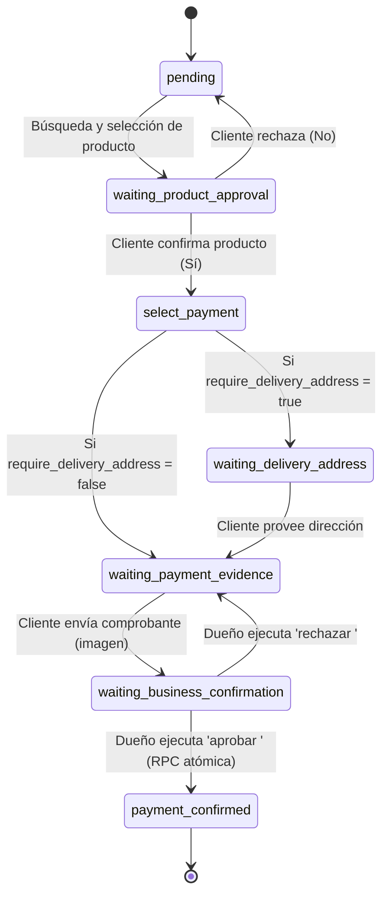

# 🏗️ Arquitectura Técnica de Flujos y Base de Datos

Este documento detalla la arquitectura de software, la máquina de estados conversacional, el modelo de datos multi-inquilino (*multi-tenant*), y el desglose de los flujos de n8n.

---

## 🧭 Diagrama General de Arquitectura

```
                        ┌──────────────────────────────────────────────┐
                        │              Meta WhatsApp API               │
                        └──────────────────────┬───────────────────────┘
                                               │ Webhook POST / GET
                                               ▼
                        ┌──────────────────────────────────────────────┐
                        │        Flujo 0: Orquestador Principal        │
                        │      (Webhook Meta + Clasificador IA)        │
                        └───────┬──────────────────────────────┬───────┘
                                │                              │
                  [ROLE == CLIENT]               [ROLE == BUSINESS]
                                │                              │
                ┌───────────────┴───────────────┐              │
                │                               │              │
                ▼                               ▼              │
   ┌──────────────────────────┐   ┌──────────────────────────┐ │
   │   Flujo 1: Ventas &      │   │ Flujo 4: Agendamiento    │ │
   │   Máquina de Estados     │   │ de Citas & Overbooking   │ │
   └────────────┬─────────────┘   └─────────────┬────────────┘ │
                │                               │              │
                │         ┌─────────────────────┴──────────────┴───────┐
                │         │                                            │
                │         ▼                                            ▼
                │  ┌──────────────────────────┐          ┌──────────────────────────┐
                │  │ Flujo 2: CRUD Productos  │          │ Flujo 3: Reportes        │
                │  │ & Stock Relativo (+/-)   │          │ Automatizados (Cron 6PM) │
                │  └────────────┬─────────────┘          └─────────────┬────────────┘
                │               │                                      │
                └───────────────┼──────────────────────────────────────┘
                                │ Transacciones / RLS / RPCs
                                ▼
                        ┌──────────────────────────────────────────────┐
                        │              Supabase PostgreSQL             │
                        │    (tenants, clients, products, sessions)    │
                        └──────────────────────────────────────────────┘
```

---

## 🔀 Desglose de Flujos N8N

### 1. `flujo0_orquestador_whatsapp.json` — Master Orchestrator
- **Entrada**: Webhook HTTPS expuesto en `/webhook/whatsapp` para métodos `GET` (desafío `hub.challenge` de Meta) y `POST` (mensajes entrantes).
- **Extracción**: Parsea el payload de Meta extrayendo `phone_number_id`, `from` (remitente), texto del mensaje, nombre de contacto e imágenes/media.
- **Identificación de Tenant**: Consulta `public.tenants` buscando `whatsapp_phone_number_id`. Si no existe, detiene la ejecución.
- **Enrutamiento por Rol**:
  - Si `sender_number == tenant.number` ➔ **ROLE: BUSINESS** (Permite comandos como `tareas`, `aprobar`, `rechazar`, `agregar stock`, etc.).
  - Si no ➔ **ROLE: CLIENT** (Crea o actualiza el registro en `public.clients`).
- **Clasificador IA**: LangChain Agent con OpenRouter para clasificar intenciones y verificar flags (`enable_sales`, `enable_crud`, `enable_reports`, `enable_appointments`).

---

### 2. `flujo1_ventas_estados.json` — Máquina de Estados de Ventas
Implementa un ciclo de vida transaccional con 7 estados sobre la tabla `public.sessions`:



- **Operación Atómica**: El cambio a `payment_confirmed` se ejecuta mediante la RPC `confirm_payment_and_deduct_stock`, garantizando que el stock se descuenta en la misma transacción y no haya inconsistencias por concurrencia.

---

### 3. `flujo2_crud_productos.json` — CRUD de Productos & Stock Relativo
- **Acciones**:
  - `ver inventario` / `catalogo`: Lista los productos activos del tenant.
  - `crear producto <nombre> precio <X> stock <Y>`: Inserta nuevo registro vinculado a `tenant_id`.
  - `agregar stock <N> a <producto>` / `restar stock <N> a <producto>`: Llama a la RPC `adjust_product_stock(p_tenant_id, p_product_name, p_quantity_change)`.
  - `cambiar precio de <producto> a <X>`: Actualiza el precio del producto con coincidencia insensible a mayúsculas (`ILIKE`).

---

### 4. `flujo3_reportes_automatizados.json` — Reportes & Métricas
- **Disparadores**:
  - **Cron Automático**: Todos los días a las 6:00 PM (hora del servidor/tenant).
  - **On-Demand**: Cuando el dueño escribe `reporte` o `generar reporte`.
- **Métricas Compiladas**:
  - Total de ingresos del día ($) de sesiones en `payment_confirmed`.
  - Conteo de pedidos completados vs pendientes.
  - Productos con stock crítico (< 5 unidades).
  - Citas completadas y canceladas.

---

### 5. `flujo4_agendamiento_citas.json` — Citas & Prevención de Overbooking
- **Lógica de Colisión**: Invoca la función `check_appointment_availability(p_tenant_id, p_appointment_date)`.
- **Regla de Negocio**: Bloquea cualquier intento de agendamiento si ya existe una cita en un intervalo de **±29 minutos** para el mismo `tenant_id`.
- **Listado para el Dueño**: El comando `ver citas` filtra citas con `status = 'scheduled'` y fecha del día en curso.

---

## 🗄️ Modelo de Datos y Seguridad (Supabase PostgreSQL)

### Tablas Principales

| Tabla | Clave Primaria | Relaciones | Descripción |
|---|---|---|---|
| `public.tenants` | `id` (UUID) | - | Configuración de cada negocio, tokens de Meta, flags de módulos. |
| `public.clients` | `id` (UUID) | `tenant_id -> tenants(id)` | Directorio de clientes aislados por negocio (`UNIQUE(tenant_id, number)`). |
| `public.products` | `id` (UUID) | `tenant_id -> tenants(id)` | Catálogo de productos, precio, stock y estado activo. |
| `public.sessions` | `id` (UUID) | `tenant_id`, `client_id`, `found_product_id` | Sesiones conversacionales, carrito de compras (`cart_items`, `total_amount`) y máquina de estados de compra. |
| `public.appointments` | `id` (UUID) | `tenant_id`, `client_id` | Citas y agenda comercial vinculada con enlaces dinámicos a Google Calendar. |

### Row Level Security (RLS)
Todas las tablas tienen activada la directiva `ROW LEVEL SECURITY` y políticas que restringen las operaciones exclusivamente al rol `service_role`. Esto garantiza que los tokens expuestos o accesos anónimos no puedan leer ni alterar datos de otros clientes o negocios.

---

## 🔘 Estándar de Mensajes Interactivos de WhatsApp

Los 5 flujos adoptan el estándar de mensajes interactivos (`type: "interactive"`) con botones de respuesta rápida (`button_reply`) y normalización unificada en el orquestador:

1. **Inbound (`flujo0_orquestador_whatsapp.json`)**:
   - Extrae automáticamente `button_reply.id`, `list_reply.id` y `location`.
   - Canaliza el ID presionado como comando natural al subflujo correspondiente.
2. **Outbound**:
   - Nodos de respuesta devuelven `buttons: [{ id: "...", title: "..." }]` (máximo 3 botones, longitud ≤ 20 caracteres).
   - El nodo HTTP construye dinámicamente el payload interactivo o de texto plano según la presencia de botones.

