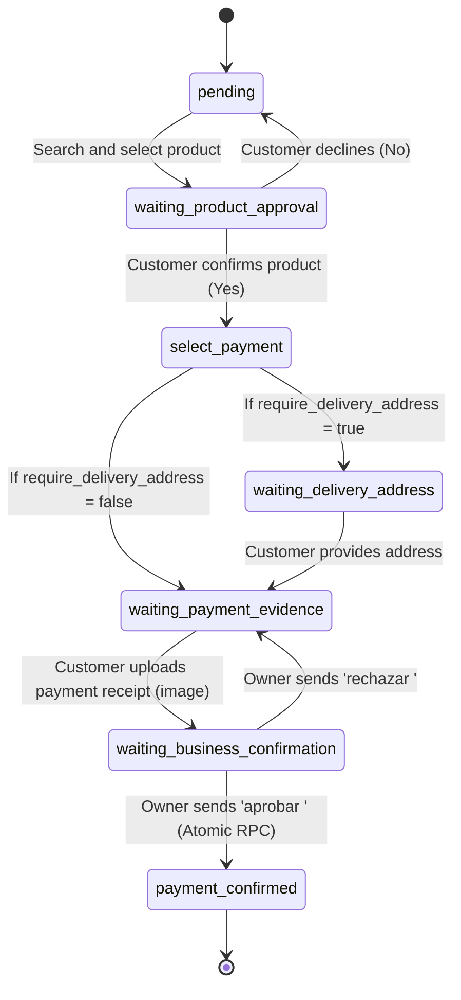

# 🏗️ Technical Architecture of Workflows & Database

This document details the software architecture, conversational finite-state machine, multi-tenant database model, and n8n workflow breakdown.

---

## 🧭 System Architecture Diagram

```
                        ┌──────────────────────────────────────────────┐
                        │              Meta WhatsApp API               │
                        └──────────────────────┬───────────────────────┘
                                               │ Webhook POST / GET
                                               ▼
                        ┌──────────────────────────────────────────────┐
                        │          Flow 0: Master Orchestrator         │
                        │     (Webhook Verification + AI Agent Router) │
                        └───────┬──────────────────────────────┬───────┘
                                │                              │
                   [ROLE == CLIENT]               [ROLE == BUSINESS]
                                │                              │
                ┌───────────────┴───────────────┐              │
                │                               │              │
                ▼                               ▼              │
   ┌──────────────────────────┐   ┌──────────────────────────┐ │
   │   Flow 1: Sales &        │   │ Flow 4: Appointment      │ │
   │   7-State Machine        │   │ Booking & Anti-Collision │ │
   └────────────┬─────────────┘   └─────────────┬────────────┘ │
                │                               │              │
                │         ┌─────────────────────┴──────────────┴───────┐
                │         │                                            │
                │         ▼                                            ▼
                │  ┌──────────────────────────┐          ┌──────────────────────────┐
                │  │ Flow 2: Catalog CRUD     │          │ Flow 3: Automated Daily  │
                │  │ & Relative Stock (+/-)   │          │ Reports (6:00 PM Cron)   │
                │  └────────────┬─────────────┘          └─────────────┬────────────┘
                │               │                                      │
                └───────────────┼──────────────────────────────────────┘
                                │ SQL Transactions / RLS / RPCs
                                ▼
                        ┌──────────────────────────────────────────────┐
                        │              Supabase PostgreSQL             │
                        │    (tenants, clients, products, sessions)    │
                        └──────────────────────────────────────────────┘
```

---

## 🔀 N8N Workflow Breakdown

### 1. `flow0_whatsapp_orchestrator.json` — Master Orchestrator
- **Inbound Webhook**: Dual endpoint structure on path `/webhook/whatsapp`:
  - `GET`: Responds immediately to Meta's `hub.challenge` verification handshake.
  - `POST`: Acknowledges incoming WhatsApp messages with `200 OK` and initiates the execution pipeline.
- **Payload Extraction**: Parses message text, interactive button replies (`button_reply.id`), list replies, sender phone number, contact profile name, and image attachments.
- **Tenant Identification**: Looks up `public.tenants` by `whatsapp_phone_number_id`. If unregistered, execution halts safely.
- **Role-Based Routing**:
  - `sender_number == tenant.number` ➔ **ROLE: BUSINESS** (Enables owner commands: tasks, approvals, stock modifications, reports).
  - Otherwise ➔ **ROLE: CLIENT** (Creates or upserts customer record in `public.clients`).
- **AI Classification**: Powered by LangChain Agent with NVIDIA Nemotron (or OpenAI-compatible LLM) to classify intent into: `help_menu`, `tasks_dashboard`, `sales`, `crud`, `reports`, or `appointments`.

---

### 2. `flow1_sales_state_machine.json` — 7-State Conversational Sales Machine
Implements a transactional state machine on the `public.sessions` table:



- **Atomic Checkout**: Finalizing payment (`payment_confirmed`) calls the `confirm_payment_and_deduct_stock` stored procedure, ensuring inventory deduction and session updates occur within a single database transaction.

---

### 3. `flow2_product_catalog_crud.json` — Catalog Management & Relative Stock
- **Actions**:
  - `ver inventario`: Returns all active items with price and stock.
  - `crear producto <name> precio <price> stock <qty>`: Inserts a new catalog product for the tenant.
  - `agregar stock <qty> a <product>` / `restar stock <qty> a <product>`: Calls RPC `adjust_product_stock`.
  - `cambiar precio de <product> a <price>`: Updates product unit price.

---

### 4. `flow3_automated_reports.json` — Financial Reports & Metrics
- **Triggers**:
  - **Daily Scheduled Cron**: Runs automatically at 6:00 PM server local time.
  - **On-Demand**: When the business owner types `reporte` or `generar reporte`.
- **Metrics Computed**:
  - Total confirmed daily revenue ($).
  - Breakdown of active sessions by stage in the purchase funnel.
  - Critical stock alerts (inventory ≤ 5 units).
  - Total new customer signups.

---

### 5. `flow4_appointment_booking.json` — Booking & Anti-Collision System
- **Conflict Prevention**: Executes `check_appointment_availability(p_tenant_id, p_appointment_date)`.
- **Business Rule**: Enforces a minimum **±29-minute buffer** between appointments for the same tenant.
- **Calendar Sync**: Builds dynamic Google Calendar 1-click add links for the client upon confirmation.

---

## 🗄️ Database Model & Security (Supabase PostgreSQL)

### Core Tables

| Table | Primary Key | Foreign Keys | Description |
|---|---|---|---|
| `public.tenants` | `id` (UUID) | - | Business settings, Meta access tokens, module feature flags. |
| `public.clients` | `id` (UUID) | `tenant_id -> tenants(id)` | Customers isolated per business (`UNIQUE(tenant_id, number)`). |
| `public.products` | `id` (UUID) | `tenant_id -> tenants(id)` | Product catalog, pricing, inventory count, and active status. |
| `public.sessions` | `id` (UUID) | `tenant_id`, `client_id` | Shopping cart items, total order amount, and sales state machine. |
| `public.appointments` | `id` (UUID) | `tenant_id`, `client_id` | Scheduled commercial bookings and calendar timestamps. |

### Row Level Security (RLS)
All database tables have `ROW LEVEL SECURITY` enabled with policies restricting operations strictly to the `service_role`. This ensures complete tenant isolation and guarantees anonymous requests cannot access other businesses' data.

---

## 🔘 WhatsApp Interactive Message Standard

Workflows leverage WhatsApp Cloud API interactive buttons (`type: "interactive"`):
1. **Inbound**: Normalizes button replies (`button_reply.id`), list selections, and geo-locations into clean text commands.
2. **Outbound**: Formats responses as interactive buttons (up to 3 buttons, ≤20 chars each) with automatic fallback to text if buttons are not required.
